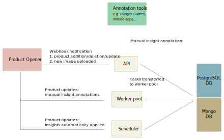

# Architecture

Robotoff is made of several services:

- the public _API_ service
- the _scheduler_, responsible for launching recurrent tasks (downloading new dataset, processing insights automatically,...) [^scheduler]
- the _workers_, responsible for all long-lasting tasks

Communication between API and Workers happens through ipc events. [^ipc_events]

[^scheduler]: See `scheduler.run`

[^ipc_events]: See `robotoff.workers.client` and `robotoff.workers.listener`

Robotoff allows to predict many information (also called _insights_), mostly from the product images or OCR.

Each time a contributor uploads a new image on Open Food Facts, the text on this image is extracted using Google Cloud Vision, an OCR (Optical Character Recognition) service. Robotoff receives a new event through a webhook each time this occurs, with the URLs of the image and the resulting OCR (as a JSON file).
We use simple string matching algorithms to find patterns in the OCR text to generate new predictions [^predictions].

We also use a ML model to extract logos from images. These logos are then embedded in a vector space using a pre-trained model. In this space we use a k-nearest-neighbor approach to try to classify the logo, predicting a brand or a label [^logos].

We use the image to detect the grade of the Nutri-Score (A to E) with a computer vision model (object detection).

The above detections generate predictions which in turn generate many types of insights [^insights]:

- labels
- stores
- packager codes
- packaging
- product weight
- expiration date
- brand
- ...

Predictions, as well as insights are stored in the PostgreSQL database.

[^predictions]: see `robotoff.models.Prediction`

[^insights]: see `robotoff.models.ProductInsight`

[^logos]: see `robotoff.logos`

These new insights are then accessible to all annotation tools (Hunger Games, mobile apps,...), that can validate or not the insight. 

If the insight is validated by an authenticated user, it's applied immediately and the product is updated through Product Opener API [^annotate]. If it's reported as invalid, no update is performed, but the insight is marked as annotated so that it is not suggested to another annotator. If the user is not authenticated, a system of votes is used (3 consistent votes trigger the insight application).

Some insights with high confidence are applied automatically, 10 minutes after import.

Robotoff is also notified by Product Opener every time a product is updated or deleted [^product_update]. This is used to delete insights associated with deleted products, or to update them accordingly.

[^product_update]: see `workers.tasks.product_updated` and `workers.tasks.delete_product_insights`
[^annotate]: see `robotoff.insights.annotate`

## Other services

Robotoff also depends on the following services:

- a single node Elasticsearch instance, used to:
  - infer the product category from the product name, using an improved string matching algorithm. [^predict_category] (used in conjunction with ML detection)
  - perform spellcheck on ingredient lists [^spellcheck_ingredients]
- a Tensorflow Serving instance, used to serve object detection models (currently, only nutriscore and category), which is identified as `robotoff-ml`[^robotoff_ml].
- [robotoff-ann](https://github.com/openfoodfacts/robotoff-ann/) which uses an approximate KNN approach to predict logo label
- MongoDB, to fetch the product latest version without querying Product Opener API.

[^predict_category]: see `robotoff.elasticsearch.predict`

[^robotoff_ml]: see `docker/ml.yml`

[^spellcheck_ingredients]: see `robotoff.spellcheck.elasticsearch.es_handler.ElasticsearchHandler`
