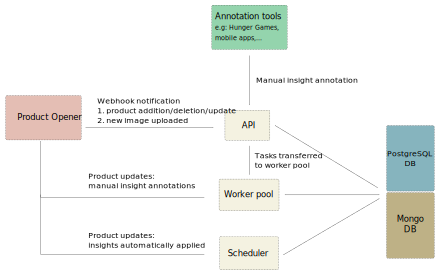

# Architecture

Robotoff is made of several services:

- the public _API_ service
- the _scheduler_, responsible for launching recurrent tasks (downloading new dataset, processing insights automatically,...) [^scheduler]
- the _workers_, responsible for all long-lasting tasks
- a _redis_ instance specific to Robotoff, used to handle locks and messaging queues
- the _update listener_, responsible for listening to Product Opener events and triggering actions accordingly
- a _PostgreSQL_ database, where all Robotoff data are stored (predictions, insights,...)
- a single node _Elasticsearch_ instance, used to index all logos to run ANN search for automatic logo classification [^logos]
- a _Triton_ instance, used to serve object detection models (nutriscore, nutrition-table, universal-logo-detector) [^robotoff_ml].

[^scheduler]: See `scheduler.run`

[^logos]: see `robotoff.models.ImageAnnotation` `robotoff.logos`

[^robotoff_ml]: see `docker/ml.yml`

Robotoff also depends on external services in production:

- the MongoDB instance of Product Opener, to fetch the latest product version without querying the Product Opener API
- the redis instance of Product Opener, where all product updates are sent to an event queue (as a [Redis Stream](https://redis.io/docs/data-types/streams/))

Communication between API and workers happens through Robotoff Redis DB using [rq](https://python-rq.org). [^worker_job]

Jobs are sent through rq messaging queues. We currently have two types of queues:

- High-priority queues, used when a product is updated/deleted, or when a new image is uploaded. All jobs associated with a product are always sent to the same queue, based on the product barcode [^product_specific_queue]. This way, we greatly reduce the risk of concurrent processing for the same product (DB deadlocks or integrity errors).
- Low priority queue `robotoff-low`, which is used for all lower-priority jobs.

Each worker listens to a single high priority queue. It handles high-priority jobs first, then low-priority jobs if the high-priority queue it's listening to is empty. This way, we ensure low priority jobs don't use excessive system resources, due to the limited number of workers that can handle such jobs.

[^worker_job]: See `robotoff.workers.queues` and `robotoff.workers.tasks`

[^product_specific_queue]: See `get_high_queue` function in `robotoff.workers.queues`

Robotoff allows to predict many information (also called _insights_), mostly from the product images or OCR.

Each time a contributor uploads a new image on Open Food Facts, the text on this image is extracted using Google Cloud Vision, an OCR (Optical Character Recognition) service. Robotoff receives a new event through a webhook each time this occurs, with the URLs of the image and the resulting OCR (as a JSON file).
We use simple string matching algorithms to find patterns in the OCR text to generate new predictions [^predictions]. To have a more in-depth understanding of the difference between predictions and insights, see the [predictions](../explanations/predictions.md) page.

We also use a ML model to extract objects from images. [^image_predictions]

One model tries to detect any logo [^logos].
Detected logos are then embedded in a vector space using the openAI pre-trained model CLIP-vit-base-patch32.
In this space we use a k-nearest-neighbor approach to try to classify the logo, predicting a brand or a label.
Hunger game also collects users annotations to have ground truth ([logo game](https://hunger.openfoodfacts.org/logos)).

Another model tries to detect the grade of the Nutri-Score (A to E) 
with a computer vision model.

The above detections generate predictions which in turn generate many types of insights [^insights]:

- labels
- stores
- packager codes
- packaging
- product weight
- expiration date
- brand
- ...

Predictions, as well as insights are stored in the PostgreSQL database.

[^predictions]: see `robotoff.models.Prediction`

[^image_predictions]: see `robotoff.models.ImagePrediction` and `robotoff.workers.tasks.import_image.run_import_image_job`

[^insights]: see `robotoff.models.ProductInsight`

These new insights are then accessible to all annotation tools (Hunger Games, mobile apps,...), that can validate or not the insight. 

If the insight is validated by an authenticated user, it's applied immediately and the product is updated through Product Opener API [^annotate]. If it's reported as invalid, no update is performed, but the insight is marked as annotated so that it is not suggested to another annotator. If the user is not authenticated, a system of votes is used (3 consistent votes trigger the insight application).

Some insights with high confidence are applied automatically, 10 minutes after import.

Robotoff is also notified by Product Opener every time a product is updated or deleted [^product_update]. This is used to delete insights associated with deleted products, or to update them accordingly.

[^product_update]: see `workers.tasks.product_updated` and `workers.tasks.delete_product_insights_job`
[^annotate]: see `robotoff.insights.annotate`
